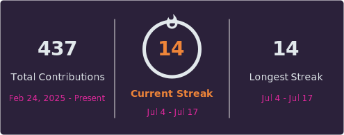

<div align="center">

# Levi Mackay


[](https://levibmackay.github.io/Portfolio/)
[](https://www.linkedin.com/in/levi-mackay-217380396/)
[](https://github.com/levibmackay/lydia-cli)

</div>

<br>

```
> whoami
```

- CS student at BYU-Idaho, building full-time inside the **Sandbox** startup accelerator
- Ships real things: a 34★ open-source AI coding agent, an AI startup validator, a security scanner — not just class assignments
- Focus areas: AI agents & developer tooling, computer vision, data systems
- Actively interviewing for **Summer/Fall 2026** software engineering internships

<br>

```
> tech.stack
```

**Languages**
<hr>


**Frameworks & Tools**
<hr>


[](https://developer.apple.com/xcode/)
[](https://ollama.com)
[](https://tailscale.com)
[](https://n8n.io)

<br>

```
> currently.working_on()
```

```json
{
  "learning":  "data structures & algorithms in C# (heaps, linked lists, priority queues)",
  "building":  "LaunchLens — AI startup validation SaaS",
  "exploring": "self-hosted infra on a Raspberry Pi 4 home server"
}
```

<br>

```
> featured.project
```

### [Lydia](https://github.com/levibmackay/lydia-cli)

Local AI coding agent for the terminal — reads and edits code, runs commands, drives git, and checks its own work by running tests, all through a local Ollama model. No API keys, no subscriptions, nothing leaves your machine.

[](https://github.com/levibmackay/lydia-cli/stargazers)
[](https://github.com/levibmackay/lydia-cli/actions/workflows/test.yml)
[](https://github.com/levibmackay/lydia-cli)

<br>

```
> other.projects
```

| Project | Description | Stack |
|---|---|---|
| [LaunchLens](https://github.com/levibmackay/LaunchLens) | AI-powered startup idea validator — SWOT, TAM/SAM/SOM, competitor research, and a validation score before you spend months building | `React` `Express` `Gemini API` |
| [SecurityScanner](https://github.com/levibmackay/SecurityScanner) | AI-powered Python security scanner that analyzes source code and prioritizes vulnerabilities by severity | `Python` `Gemini API` |
| [RepoVisualizer](https://github.com/levibmackay/RepoVisualizer) | Recursive C# tool that maps a repo's folder hierarchy and generates a Markdown report of file types, sizes, and structure | `C#` |
| [NFC Card](https://github.com/levibmackay/nfc-card) | NFC-powered digital business card that shares my portfolio, projects, and contact info with a single tap | `TypeScript` `React` `Tailwind CSS` |

<br>

```
> github.stats
```

<div align="center">



</div>

<br>

```
> contact.init()
```

```json
{
  "github":    "github.com/levibmackay",
  "linkedin":  "linkedin.com/in/levi-mackay-217380396",
  "portfolio": "levibmackay.github.io/Portfolio",
  "status":    "open to SWE internships"
}
```

<div align="center">

**"Let's build something real."**

</div>

_Last updated: July 22, 2026_

_Last reviewed: 2026-07-20 19:33 MDT_

---
**Last updated:** 2026-07-21
