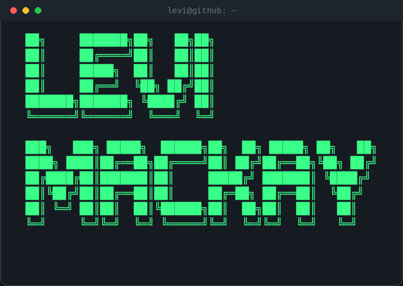
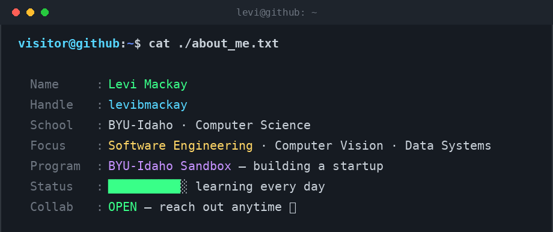

<div align="center">



**Computer Science Student @ BYU-Idaho** · Software Developer · Computer Vision & Data Engineering
Currently building at BYU-Idaho's **Sandbox** startup program

[](https://levibmackay.github.io/Portfolio/website/index.html)
[](https://www.linkedin.com/in/levi-mackay-217380396/)

</div>

<br>

<div align="center">

</div>

<br>

> tech.stack

**Languages**


**Frameworks & Tools**


[](https://ollama.com)
[](https://tailscale.com)
<br>

```
> currently.working_on()
```

```json
{
  "learning":   "data structures & algorithms in C# (heaps, linked lists, priority queues)",
  "building":   "LaunchLens — AI startup validation SaaS",
  "exploring":  "self-hosted infra on a Raspberry Pi 4 home server",
  "goal_2026":  "land a software engineering internship"
}
```

<br>

```
> pinned.projects
```


| Project | Description | Stack |
|---|---|---|
| [LaunchLens](https://github.com/levibmackay/LaunchLens) | AI-powered startup idea validator — SWOT, TAM/SAM/SOM, competitor research, validation score | `React` `Express` `Gemini API` |
| [Lydia](https://github.com/levibmackay/Lydia) | AI-powered Canvas companion that helps students manage assignments, deadlines, and coursework | `React` `Express` `Canvas API` |
| [NFCCard](https://github.com/levibmackay/NFCCard) | NFC-powered digital business card for instantly sharing my portfolio, projects, resume, and contact information | `TypeScript` `React` `Tailwind CSS` |
| [SecurityScanner](https://github.com/levibmackay/SecurityScanner) | AI-powered Python security scanner that prioritizes vulnerabilities by severity | `Python` `Gemini API` |
| [RepoVisualizer](https://github.com/levibmackay/RepoVisualizer) | Recursive C# tool that maps a repo's folder hierarchy and generates a Markdown report | `C#` |
<br>

```
> github.stats
```

<div align="center">


</div>

<br>

```
> contact.init()
```

```json
{
  "github":  "github.com/levibmackay",
  "linkedin": "linkedin.com/in/levi-mackay-217380396",
  "portfolio": "levibmackay.github.io/Portfolio",
  "status": "open to SWE internships"
}
```

<div align="center">

**"Let's build something real."**

</div>
