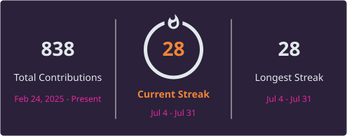

<div align="center">

# Levi Mackay


[](https://levimackay.com/)
[](https://www.linkedin.com/in/levi-mackay-217380396/)
[](https://github.com/levimackay/lydia-cli)

</div>

<br>

```
> whoami
```

- CS student at BYU-Idaho, building full-time inside the **Sandbox** startup accelerator
- Ships real things: a 34★ open-source AI coding agent, an AI startup validator, a security scanner — not just class assignments
- Focus areas: AI agents & developer tooling, computer vision, data systems
- Actively interviewing for **Summer/Fall 2026** software engineering internships

<br>

```
> tech.stack
```

**Languages**
<hr>


**Frameworks & Tools**
<hr>


[](https://developer.apple.com/xcode/)
[](https://ollama.com)
[](https://tailscale.com)
[](https://n8n.io)

<br>

```
> currently.working_on()
```

```json
{
  "learning":  "data structures & algorithms in C# (heaps, linked lists, priority queues)",
  "building":  "LaunchLens — AI startup validation SaaS",
  "exploring": "self-hosted infra on a Raspberry Pi 4 home server"
}
```

<br>

```
> featured.project
```

### [PreCheck AI](https://github.com/levimackay/PrecheckAI)

A pre-AI checklist gate for coding practice. Before you ask an assistant for help, you have to prove in writing that you actually tried the problem yourself — complete with live validation, auto-assembled hint prompts, and local streak tracking.

[](https://github.com/levimackay/PrecheckAI/stargazers)
[](https://github.com/levimackay/PrecheckAI/blob/main/LICENSE)
[](https://github.com/levimackay/PrecheckAI)

<br>

```
> pinned.projects
```

| Project | Description | Stack |
|---|---|---|
| [AIR (AI Router)](https://github.com/levimackay/air) | Load balancer and orchestrator for AI coding agent CLIs — launches, monitors, checkpoints, and auto-switches providers on failure | `Go` `Cobra` `Bubble Tea` |
| [PrecheckAI](https://github.com/levimackay/PrecheckAI) | Pre-AI checklist gate for coding practice — forces written problem articulation and hypotheses before unlocking AI hint prompts | `React` `JavaScript` `HTML` |
| [SecurityScanner](https://github.com/levimackay/SecurityScanner) | AI-powered Python security scanner that analyzes source code and prioritizes vulnerabilities by severity | `Python` `Gemini API` |
| [C# DSA Academy](https://github.com/levimackay/csharp-dsa-academy) | Project-based DSA practice — 12 modules (linked lists, trees, heaps, graphs, DP, and more), each with its own xUnit test suite | `C#` `.NET` `xUnit` |
| [Lydia](https://github.com/levimackay/lydia-cli) | Local AI coding agent CLI for reading and editing code via local Ollama models | `Python` `Ollama` |

<br>

```
> github.stats
```

<div align="center">



</div>

<br>

```
> contact.init()
```

```json
{
  "github":    "github.com/levimackay",
  "linkedin":  "linkedin.com/in/levi-mackay-217380396",
  "portfolio": "levimackay.com",
  "status":    "open to SWE internships"
}
```

<div align="center">

**"Let's build something real."**

</div>

_Last updated: July 22, 2026_

_Last reviewed: 2026-07-20 19:33 MDT_

---
**Last updated:** 2026-08-04 16:57 PDT

---

Maintained by [Levi Mackay](https://github.com/levimackay)

